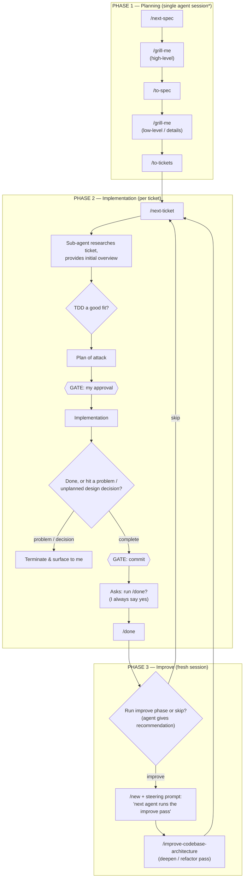

# Development Workflow

My end-to-end workflow across the **Planning → Implementation → Improve** phases, with notes on how I actually run it today and introspections on what should change.

---

## High-Level Flow

**\*** Planning runs back-to-back-to-back in one session — *unless* context usage says otherwise (see Session Hygiene below).

---

## Session Hygiene Rules

- **Hard rule: never let an agent exceed ~30% session context usage.**
- When planning would blow the budget, I split it into **two sessions**: run `/new` after `/to-spec` completes, with a steering prompt like *"the next agent should run `/grill-me` on the draft spec we just wrote."*
- Session handoff happens one of two ways, and honestly I'm not sure there's a rhyme or reason to which I pick:
  1. `/new` + a steering prompt for the next agent, **or**
  2. `ctrl+c` to kill the Claude Code TUI entirely, drop back to my terminal emulator, start a fresh `claude` process, and invoke the skill manually in chat.

---

## Notes & Introspections

### Things that should be promoted / codified

- **Ticket research sub-agent → make it default.** The `/next-ticket` research step (sub-agent researches the ticket and produces an initial overview) is currently configurable. From my testing it's super helpful and ready to be promoted to default — maybe even non-configurable.
- **The `tdd`-or-not gate is under-specified.** Right now the agent chooses between `tdd` or *not*-`tdd`, but the "not" path isn't codified — there's no explicit `implement` skill. Proposal: the gate should switch between **`tdd` or `implement`**, where `implement` is a more ambiguous plan-then-execute flow, codified with explicit stopping rules: stop when complete, or when issues / non-designed decisions arise that need my input. (This is how it behaves today, but only informally.)
- **Auto-commit + auto-`/done`.** Currently the agent gates on commit and then *asks* whether to run `/done` — and I always say yes. It should instead commit automatically once implementation is complete and run `/done` automatically as its exit tasks.
- **Improve-phase prompt should always carry a recommendation.** At the end of `/done`, when asked "improve or skip?", the agent should always recommend which it thinks is better based on the subject/nature of the work.

### Open questions

- **How does `improve-codebase-architecture` relate to Matt's `code-review` skill?** I'm curious whether `code-review` could augment the improve pass, or whether it's actually more closely related to `/done`. Maybe bits of both?
- **Session handoff style:** worth paying attention to when I reach for `/new` + prompt vs. a full process restart, to see if there's an actual pattern behind it.
